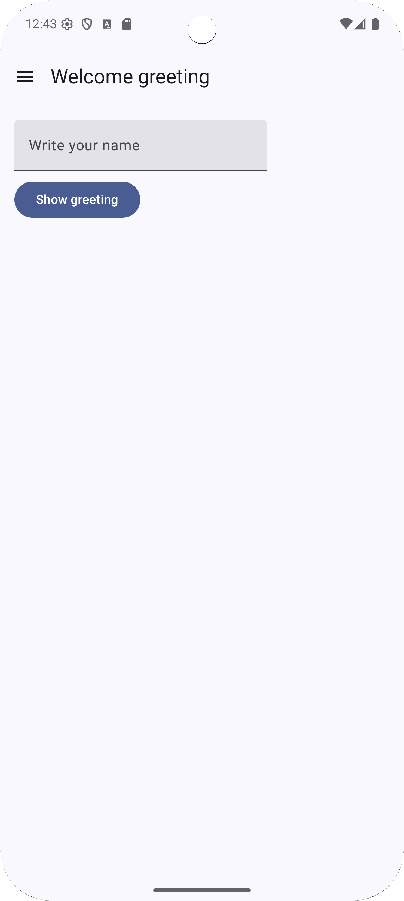
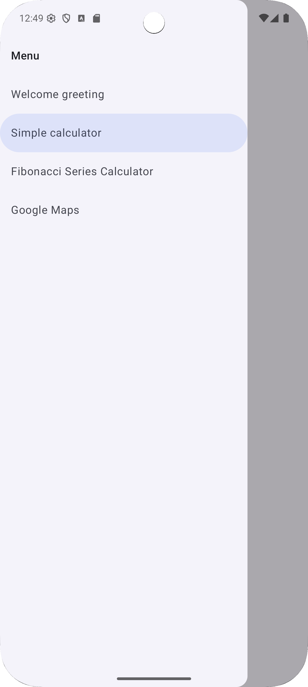
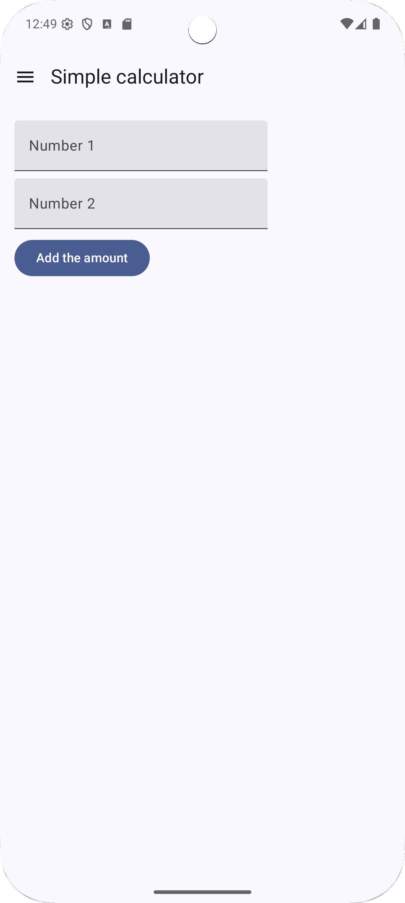
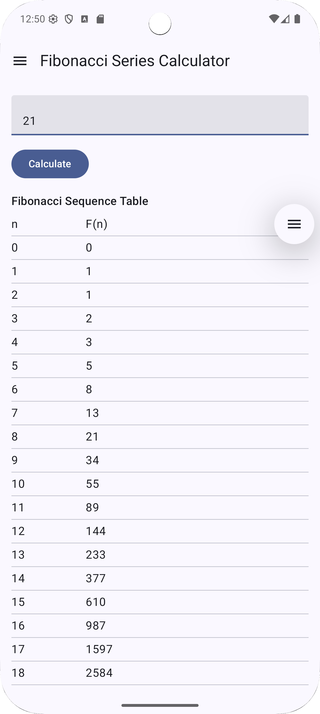
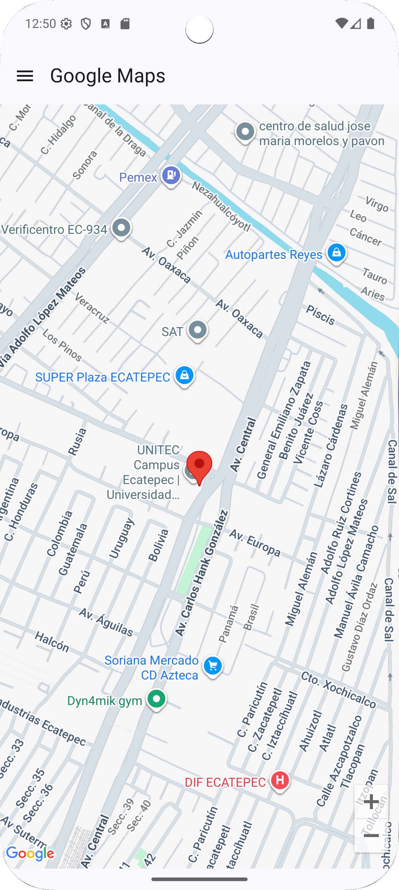

# Aprende + (Aprende Kotlin) - Kotlin Jetpack Compose

<center>
  
</center>

[](https://kotlinlang.org/)
[](https://developer.android.com/jetpack/compose)
[](https://developer.android.com/)
[](https://developers.google.com/maps)

**Aprende +** es una aplicación educativa desarrollada en **Kotlin** con **Jetpack Compose**, diseñada para enseñar conceptos básicos y avanzados de Kotlin mediante ejemplos interactivos.

> ⚠️ **Nota:** El ícono de la aplicación fue generado con [icon.kitchen](https://icon.kitchen/).

---

## 🔹 Funcionalidades

* **Saludo dinámico**: Ingresa un nombre y muestra un mensaje personalizado.
* **Calculadora simple**: Suma dos números ingresados por el usuario.
* **Serie de Fibonacci recursiva**: Calcula la serie de Fibonacci usando recursión.
* **Mapa interactivo**: Visualiza la ubicación de **Unitec Ecatepec** con Google Maps Compose.

La navegación se realiza mediante un **menú lateral (Drawer)** dinámico.

---

## 📸 Capturas de pantalla

<div style="display: flex; overflow-x: auto; gap: 12px;">
  
  
  
  
  
</div>

---

## 🛠 Tecnologías

* **Lenguaje:** Kotlin
* **UI:** Jetpack Compose (Material3)
* **Arquitectura:** ViewModel, State Management
* **Google Maps Compose:** `com.google.maps.android:maps-compose`
* **Dependencias AndroidX**

---

## ⚙️ Instalación y ejecución

### 1️⃣ Clonar el repositorio

```bash
git clone https://github.com/josprox/Aprende-Kotlin-Basico.git
cd pruebas-app
```

### 2️⃣ Abrir en Android Studio

* Abre **Android Studio (Arctic Fox o superior)**.
* Selecciona **Open an existing project** y busca la carpeta del repositorio.
* Sincroniza dependencias: **Sync Project with Gradle Files**.

### 3️⃣ Configurar la API Key de Google Maps

1. Ve a [Google Cloud Console](https://console.cloud.google.com/).
2. Crea un proyecto y habilita **Maps SDK for Android**.
3. Genera una **API Key**.
4. Crea el archivo `res/values/google_maps.xml`:

```xml
<?xml version="1.0" encoding="utf-8"?>
<resources>
    <string name="googleplay_maps" translatable="false">TU_API_KEY</string>
</resources>
```

> 🔹 Opcional: Para mayor seguridad, puedes usar `.env` con **dotenv**.

### 4️⃣ Ejecutar la aplicación

* Conecta un dispositivo físico o emulador con Google Play Services.
* Ejecuta desde Android Studio (`Shift + F10`).

---

## 📝 Uso de la app

1. Abre el **menú lateral** y selecciona la sección:

   * **Saludo**: Ingresa un nombre y presiona "Mostrar saludo".
   * **Calculadora**: Ingresa dos números y presiona "Sumar".
   * **Fibonacci**: Ingresa la cantidad de términos y presiona "Calcular".
   * **Mapa Unitec**: Visualiza la ubicación de Unitec Ecatepec con marcador.

2. Todas las pantallas usan **State** y **ViewModel** para mantener los datos mientras navegas entre secciones.

---

## 📁 Estructura del proyecto

```
app/
├─ src/main/java/com/josprox/pruebas/
│  ├─ MainActivity.kt
│  ├─ ui/screens/
│  │  ├─ HomeScreen.kt (menú lateral + Scaffold)
│  │  ├─ exercises/
│  │  │  ├─ Saludo.kt
│  │  │  ├─ Calculadora.kt
│  │  │  ├─ PantallaFibonacci.kt
│  │  │  └─ PantallaMaps.kt
│  ├─ ui/routes/
│  │  └─ AppRoute.kt (gestión de rutas y títulos de pantallas)
│  └─ ui/viewmodel/
│     └─ FibonacciViewModel.kt
```

---

## ✅ Buenas prácticas aplicadas

* **Separación de lógica y UI:** la lógica de Fibonacci se maneja en ViewModel.
* **Rutas centralizadas:** navegación controlada mediante `AppRoute`.
* **Manejo de estado en Compose:** `remember` y `mutableStateOf`.
* **Google Maps Compose:** manejo de cámara y marcadores con `rememberCameraPositionState` y `rememberUpdatedMarkerState`.

---

## 🔧 Personalización

* Añade nuevas pantallas creando un objeto que implemente `AppRoute` y agrégalo a `AppRoute.allRoutes`.
* Modifica los ViewModels para ampliar la calculadora o Fibonacci.

---

## 🚀 Próximas funcionalidades

* Integración de más ejercicios interactivos de Kotlin.
* Mejoras en el diseño de la interfaz (Material3 avanzado).
* Exportar resultados de ejercicios a PDF o compartirlos.

---

## 🤝 Contribuciones

1. Haz un fork del repositorio.
2. Crea una rama: `git checkout -b feature/nueva-pantalla`.
3. Realiza los cambios y haz commit.
4. Abre un Pull Request para revisión.
